# NovaTech — Benchmark y Arquitectura

---

## 1. Arquitectura Actual (MVP)

### 1.1 Diagrama de Flujo Completo con Tecnologías

```mermaid
flowchart TD
    U(["👤 Usuario\nNavegador Web"])

    subgraph FE["CAPA FRONTEND — Gradio 4.x · Python"]
        LOGIN["🔐 Pantalla de Login\n──────────────────\ngr.Blocks · gr.Column\ngr.Textbox · gr.Button\nAuth: dict Python hardcodeado\nCSS custom: paleta azul corporativo"]
        CHAT["💬 Panel de Chat\n──────────────────\ngr.Chatbot (height=320)\ngr.Textbox · gr.Examples\ngr.HTML spinner (CSS animation)\nlock/unlock: gr.update(interactive=)"]
        IMG["🖼 Imágenes inline\n──────────────────\nFormato tuple Gradio\n(img_path,) → renderiza en chat"]
    end

    subgraph SEC["CAPA DE SEGURIDAD — backend.py"]
        SQLDENY["🚫 Bloqueo SQL Destructivo\n──────────────────\nMódulo: re (Python stdlib)\nPatrones: DROP · DELETE · TRUNCATE\nALTER · UPDATE · INSERT · CREATE\nEjecución: antes de cualquier LLM call"]
        GUARD["🛡 Guardrail LLM\n──────────────────\nModelo: gemini-2.5-flash\nCliente: ChatGoogleGenerativeAI\nLibrería: langchain-google-genai\nTemperatura: 0.0\nDecisión: PASAR / BLOQUEAR"]
    end

    subgraph HIST["CONTEXTO DE CONVERSACIÓN"]
        CTX["📋 Historial\n──────────────────\nÚltimos 5 turnos\nEstructura: list of lists\nPasado como string al orquestador"]
    end

    subgraph ORCH["ORQUESTADOR — run_reports_crew() · backend.py"]

        subgraph N0["ANÁLISIS RÁPIDO (bypass pipeline)"]
            ANA_SHORT["🔍 Shortcut análisis\n──────────────────\nDetección: needs_analysis()\nKeywords: 'por qué' · 'qué explica'\nUsa: last_query_result (estado global)\nSin nueva consulta SQL"]
        end

        subgraph N1["NIVEL 1 — Código puro · ~80ms · 0 LLM calls"]
            MATCH["⚡ match_intent()\n──────────────────\nNormalización: unicodedata.normalize NFD\nFuzzy matching: difflib.get_close_matches (cutoff=0.75)\nDetección: set intersections (_CIUDADES_SET · _MESES_SET)\nFlags: peor · mejor · tiene_filtro_param\nCatálogo: SQLS dict (45 SQLs estáticos)\nPlantillas: SQLS_PARAM (9 templates con {where_sucursal} {where_fecha})"]
        end

        subgraph N2["NIVEL 2 — Clasificador LLM · ~2–3s · 1 LLM call"]
            CLASS["🧠 _classify_intent()\n──────────────────\nModelo: gemini-2.5-flash · temp=0.0\nCliente: ChatGoogleGenerativeAI (LangChain)\nSalida: JSON {intent, sucursal, fecha_inicio, fecha_fin}\nParsing: json.loads() + validación\n_apply_params(): WHERE clauses validadas con re\nSalvaguarda ciudad: _CIUDADES_SET + difflib\nSalvaguarda fecha: _MES_MAP + re.search año\n_UPGRADE_PARAM: global → paramétrico si hay ciudad/fecha"]
        end

        subgraph N3["NIVEL 3 — Agente CrewAI · ~8–15s · 2–4 LLM calls"]
            CREW["🤖 CrewAI Framework\n──────────────────\nFramework: crewai (Agent · Task · Crew · Process.sequential)\nModelo agente: gemini-2.0-flash (LLM_SQL)\nHerramienta 1 — schema_tool():\n  @tool decorator · sqlite3.connect\n  Lee sqlite_master → devuelve DDL completo\n  Caché: _schema_cache (estado global)\nHerramienta 2 — query_tool():\n  Recibe SQL string · ejecuta _execute_sql()\n  Retorna markdown via pandas\nVerbose: False · allow_delegation: False"]
        end

        N0 -->|"no es análisis o sin datos previos"| N1
        N1 -->|"None (no match)"| N2
        N2 -->|"desconocido"| N3
    end

    subgraph DB["BASE DE DATOS — SQLite"]
        SQLITE["🗄 novatech.db\n──────────────────\nMotor: SQLite 3 · Modo: solo lectura (SELECT)\nConexión: sqlite3.connect() + pandas.read_sql_query()\nTablas (8): sucursales · empleados · productos\n  clientes · ventas · cobranza · gastos · inventario\nÍndices (4): idx_ventas_fecha · idx_ventas_sucursal\n  idx_cobranza_fecha · idx_cobranza_cliente\nVolumen: 15,000 ventas · 500 clientes · 100 empleados\n  50 productos · 8 sucursales · 3,000 gastos\nGenerado por: 01_pipeline.py (Faker · NumPy · random)"]
    end

    subgraph POST["POST-PROCESAMIENTO — backend.py"]
        NAT["📝 _naturalize()\n──────────────────\n1 fila → gemini-2.5-flash · temp=0.2\n  Prompt: presenta dato como hecho confirmado\n  Prohíbe: frases de duda / alucinación\nN filas → pandas DataFrame.to_markdown()\n  Formato: tabla Markdown con alineación\nFormato $: Money columns via MONEY_KEYWORDS\n  Excluye conteos via COUNT_KEYWORDS"]
        ANALYZE["🔍 _analyze()\n──────────────────\nModelo: gemini-2.5-flash · temp=0.3\nEntrada: last_query_result (DataFrame)\nPregunta: 'por qué' · 'qué explica' · etc.\nSolo interpreta datos reales\nProhíbe: recomendaciones inventadas"]
        CHART["📊 generate_chart()\n──────────────────\nLibrería: Plotly Express · px.bar\nSelección Y: prefiere columnas monetarias\n  (MONEY_PREF) sobre conteos (COUNT_EXCL)\nFormato: color_continuous_scale=Blues\nhovertemplate personalizado\nExportación: kaleido 0.2.1 → PNG\n  tempfile.NamedTemporaryFile · suffix=.png\n  Dimensiones: 750×420 px"]
    end

    U -->|"HTTPS / localhost"| FE
    FE --> SQLDENY
    SQLDENY -->|"SQL detectado"| FE
    SQLDENY -->|"OK"| GUARD
    GUARD -->|"BLOQUEAR"| FE
    GUARD -->|"PASAR"| HIST
    HIST --> ORCH
    N1 & N2 & N3 -->|"SQL query"| SQLITE
    SQLITE -->|"pandas DataFrame"| POST
    POST -->|"texto / imagen"| FE
```

---

### 1.2 Stack Tecnológico por Capa

| Capa | Tecnología | Versión | Rol |
|------|-----------|---------|-----|
| Frontend | Gradio | 4.x | UI conversacional, login, imágenes inline |
| Seguridad SQL | Python `re` | stdlib | Bloqueo de comandos destructivos |
| Guardrail | gemini-2.5-flash + LangChain | — | Clasificación PASAR/BLOQUEAR |
| LLM cliente | `langchain-google-genai` | — | `ChatGoogleGenerativeAI` |
| Intent L1 | `unicodedata` · `difflib` | stdlib | Normalización + fuzzy matching |
| Intent L2 | gemini-2.5-flash | temp=0.0 | Clasificador JSON de intenciones |
| Intent L3 | CrewAI + gemini-2.0-flash | — | Agente autónomo generador de SQL |
| Base de datos | SQLite 3 | stdlib | Almacenamiento y consulta |
| Data layer | `sqlite3` + `pandas` | — | Conexión y transformación de resultados |
| Naturalización | gemini-2.5-flash | temp=0.2 | Respuesta en lenguaje natural |
| Análisis | gemini-2.5-flash | temp=0.3 | Interpretación de datos |
| Gráficas | Plotly Express + kaleido | 0.2.1 | Bar charts → PNG |
| Generación datos | `Faker` · `NumPy` · `random` | — | Pipeline sintético `01_pipeline.py` |
| API key | `GEMINI_API_KEY` | env var | Autenticación Google AI |

---

## 2. Benchmark de Rendimiento

### 2.1 Latencia por Componente

| Componente | Mecanismo | LLM Calls | Mín | Máx | Promedio |
|-----------|-----------|-----------|-----|-----|----------|
| Guardrail | 1 LLM call | 1 | 0.8 s | 1.5 s | ~1.0 s |
| Nivel 1 — match_intent | Código puro | 0 | 5 ms | 120 ms | ~80 ms |
| Nivel 2 — clasificador | 1 LLM call + SQL | 1 | 1.2 s | 3.5 s | ~2.2 s |
| Nivel 3 — CrewAI | 2–4 LLM calls + SQL | 2–4 | 7 s | 18 s | ~11 s |
| _naturalize (1 fila) | 1 LLM call | 1 | 0.8 s | 1.8 s | ~1.1 s |
| _naturalize (tabla) | pandas to_markdown | 0 | < 5 ms | 10 ms | ~5 ms |
| _analyze | 1 LLM call | 1 | 1.0 s | 2.5 s | ~1.5 s |
| SQLite query | sqlite3 + pandas | 0 | 10 ms | 150 ms | ~50 ms |

### 2.2 Latencia Total por Escenario

| Escenario | Desglose | Total |
|-----------|----------|-------|
| Nivel 1 + tabla | Guardrail + SQL + to_markdown | **~1.1 s** |
| Nivel 2 + tabla | Guardrail + Clasificador + SQL + to_markdown | **~3.3 s** |
| Nivel 3 + tabla | Guardrail + CrewAI + to_markdown | **~12 s** |
| Análisis "¿por qué?" | Guardrail + _analyze (datos en memoria) | **~2.5 s** |

### 2.3 Distribución de Consultas por Nivel

| Nivel | % Consultas | Consultas típicas |
|-------|-------------|------------------|
| Nivel 1 | ~55% | Globales sin filtros: mejor producto, ventas por sucursal |
| Nivel 2 | ~38% | Con ciudad o período: vendedores de Monterrey en enero |
| Nivel 3 | ~7% | Exóticas: cruces no anticipados, preguntas complejas |

> **93% de las consultas** se resuelven sin activar CrewAI → latencia promedio **~2.5 s**.

---

## 3. Arquitectura Mejorada (Propuesta para Producción)

### 3.1 Diagrama de Arquitectura Productiva

```mermaid
flowchart TD
    U(["👤 Usuario\nNavegador Web"])

    subgraph FE_PROD["CAPA FRONTEND — React 18 + Next.js 14"]
        UI["⚛️ Interfaz\n──────────────────\nReact 18 · Next.js 14 (App Router)\nTypeScript · Tailwind CSS\nStreaming: WebSockets (socket.io)\nRespuesta token a token\nGráficas: Recharts / Chart.js"]
        AUTH_FE["🔐 Autenticación\n──────────────────\nJWT almacenado en httpOnly cookie\nRefresh token automático\nRoles: gerente_ventas · admin · director"]
    end

    subgraph GW["API GATEWAY — FastAPI + Python 3.12"]
        API["🔌 REST API\n──────────────────\nFramework: FastAPI\nFormato: JSON · async/await\nEndpoints: /chat · /query · /chart · /health\nRate limiting: slowapi (10 req/min por usuario)\nCORS · HTTPS (TLS 1.3)\nSwagger UI autogenerado"]
        JWT_MW["🛡 Middleware Auth\n──────────────────\nLibrería: python-jose · passlib\nVerifica JWT en header Authorization\nExtrae rol y permisos\nAuditoría: registra cada request"]
    end

    subgraph CACHE["CAPA DE CACHÉ — Redis"]
        REDIS["⚡ Redis 7\n──────────────────\nCaché semántica por embedding\nSimilitud coseno > 0.95 → hit\nTTL ventas: 1 hora\nTTL empleados/productos: 24 horas\nTTL resumen ejecutivo: 6 horas\nLibrería: redis-py · numpy (coseno)"]
    end

    subgraph EMB["CAPA DE EMBEDDINGS"]
        EMBED["🔢 Búsqueda Semántica\n──────────────────\nModelo: text-embedding-004 (Google)\nÍndice: 45+ intenciones pre-embedidas\nSimilitud: coseno con numpy\nUmbral match: ≥ 0.85 → Nivel 1\nUmbral caché: ≥ 0.95 → respuesta cacheada\nReemplaza: keyword matching exacto"]
    end

    subgraph PIPE_PROD["PIPELINE DE IA — backend mejorado"]
        SEC_PROD["🚫 Seguridad\n──────────────────\nBloqueo SQL: re (sin cambios)\nGuardrail: gemini-2.5-flash (sin cambios)\nInput sanitization: pydantic validators"]
        N1_PROD["⚡ Nivel 1 — Embeddings · ~200ms\n──────────────────\nEmbedding pregunta: text-embedding-004\nBúsqueda coseno sobre índice pre-calculado\nFallback: keyword matching actual (backup)\nCobertura esperada: ~75% (vs 55% actual)"]
        N2_PROD["🧠 Nivel 2 — Clasificador · ~2s\n──────────────────\nSin cambios estructurales\nMejora: prompt con ejemplos few-shot\nValidación: pydantic para params extraídos"]
        N3_PROD["🤖 Nivel 3 — CrewAI · ~8–12s\n──────────────────\nMejora: memoria entre sesiones\nSQL validation antes de ejecutar\nReintentos con backoff exponencial"]
    end

    subgraph DB_PROD["BASE DE DATOS — PostgreSQL + pgvector"]
        PG["🗄 PostgreSQL 16\n──────────────────\nExtensión: pgvector (embeddings nativos)\nEsquema: mismo modelo NovaTech\nConexión: asyncpg (async)\nPool: SQLAlchemy 2.0 async\nÍndices: BRIN para fechas · B-tree para IDs\nTabla extra: query_logs (auditoría)\nBackups: pg_dump diario automático"]
    end

    subgraph OBS["OBSERVABILIDAD — Monitoreo"]
        LANG["📊 LangSmith\n──────────────────\nTracing de cada LLM call\nLatencia · tokens · costo por query\nDetección de prompts problemáticos\nDashboard de calidad de respuestas"]
        LOGS["📋 query_logs (PostgreSQL)\n──────────────────\nCampos: usuario · pregunta · nivel_usado\n  latencia_ms · tokens · éxito · timestamp\nConsultas analíticas sobre el propio sistema\nAlertas: si Nivel 3 > 30% de queries → revisar"]
    end

    subgraph INFRA["INFRAESTRUCTURA — Docker + Cloud"]
        DOCK["🐳 Docker Compose\n──────────────────\nContenedores: api · frontend · redis · postgres\nVariables: .env (no hardcoded)\nCICD: GitHub Actions → build + test + deploy\nDeploy: Cloud Run (GCP) o Railway"]
    end

    U -->|"HTTPS"| FE_PROD
    FE_PROD -->|"JWT + query"| GW
    GW -->|"embedding check"| CACHE
    CACHE -->|"miss"| EMB
    EMB -->|"intent + params"| PIPE_PROD
    PIPE_PROD -->|"SQL async"| DB_PROD
    DB_PROD -->|"DataFrame"| PIPE_PROD
    PIPE_PROD -->|"respuesta"| GW
    GW -->|"stream / JSON"| FE_PROD
    PIPE_PROD -->|"traces"| OBS
    INFRA -.->|"orquesta"| GW & DB_PROD & CACHE
```

---

### 3.2 Stack Tecnológico Propuesto

| Capa | Actual (MVP) | Propuesto (Producción) | Motivo del cambio |
|------|-------------|----------------------|------------------|
| Frontend | Gradio 4.x | React 18 + Next.js 14 | Streaming, UX, mobile |
| Auth | Dict hardcodeado | JWT + python-jose | Seguridad, roles, auditoría |
| API | Embebida en Gradio | FastAPI + async | REST, escalabilidad, docs |
| Rate limiting | Ninguno | slowapi | Protección contra abuso |
| Intent L1 | Keyword + difflib | text-embedding-004 | Cobertura: 55% → 75% |
| Caché | Ninguna | Redis 7 (semántica) | ~30% queries sin LLM |
| Base de datos | SQLite | PostgreSQL 16 + pgvector | Concurrencia, embeddings |
| ORM | sqlite3 + pandas | SQLAlchemy 2.0 async | Pool de conexiones |
| Observabilidad | print() | LangSmith + query_logs | Debug, costos, calidad |
| Deploy | `python 02_app.py` | Docker + Cloud Run | Escalabilidad, CI/CD |

### 3.3 Impacto Esperado de Mejoras

| Métrica | Actual | Propuesto | Mejora |
|---------|--------|-----------|--------|
| Latencia promedio | ~2.5 s | ~0.9 s | −64% |
| Cobertura Nivel 1 | 55% | ~75% | +20 pp |
| Queries sin LLM (caché) | 0% | ~30% | +30 pp |
| Usuarios simultáneos | 1 | 50+ | ×50 |
| Riesgo SQL incorrecto (N3) | ~10% | ~5% | −50% |
| Costo LLM por 1,000 queries | Alto | ~40% menor | −40% |
